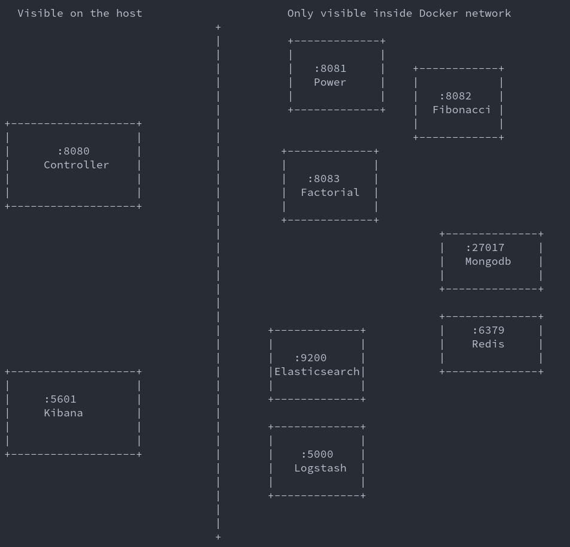

# Micromath

Toy microservice architecture for 3 math operations: exponentiation, fibonacci and factorial

### Requirements
1. Python >=3.8
2. Docker

### Installation

```bash
python setup.py install
```

### Build

```bash
docker-compose up -d
```

### Example usage

```python
import requests
sess = requests.Session()

sess.post('http://localhost:8080/api/v1/pow', json={'base': 2, 'power': 3})
sess.post('http://localhost:8080/api/v1/fibonacci', json={'number': 10})
sess.post('http://localhost:8080/api/v1/factorial', json={'number': 10})

logs = sess.get('http://localhost:8080/api/v1/logs?page=1')
```


### Destory

```bash
docker-compose down --rmi all
```


### Architecture

<p align="center">
  
</p>


### TODO

* Reverse proxy (nginx)
* TLS support
* Refactor the routes with Viewes, they can achieve better code quality than routes
